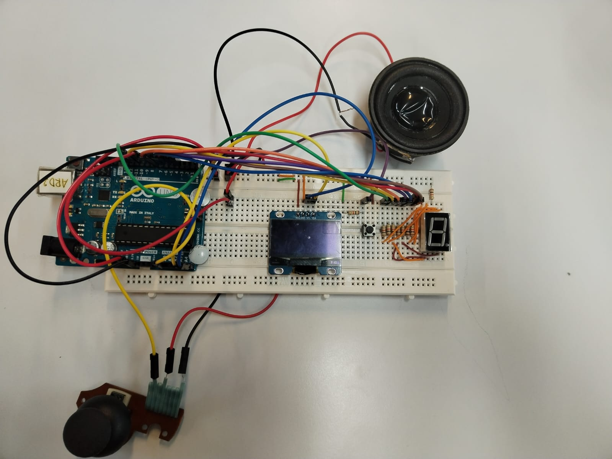
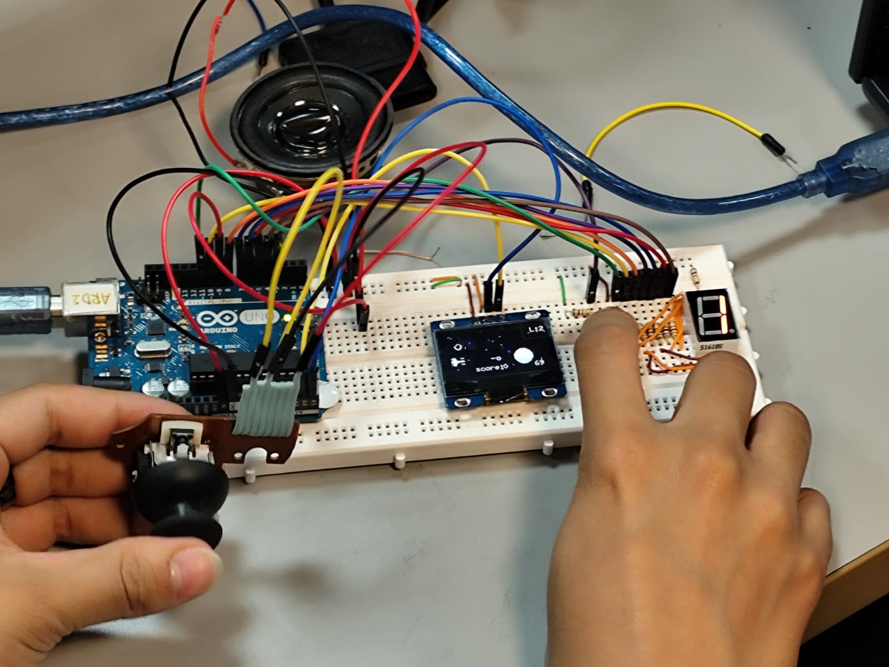
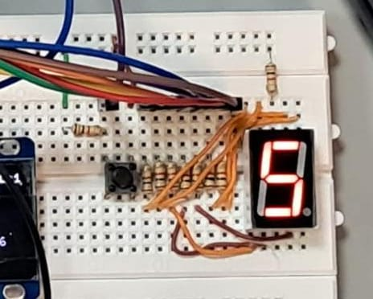

# ⭐ Galactic Invaders: Star Wars Arcade Game with Arduino ⭐

> Una experiencia lúdica y educativa basada en el universo de Star Wars, desarrollada con Arduino, electrónica básica y mucha creatividad galáctica.

## 🎮 Descripción

**Galactic Invaders** es un videojuego tipo arcade, inspirado en *Space Invaders*, ambientado en el universo de *Star Wars*. Fue desarrollado como proyecto final del curso de Arquitectura de Computadores, y construido con **componentes electrónicos en su mayoría reutilizados**, demostrando que el aprendizaje práctico no requiere grandes presupuestos.

Este juego se visualiza en una pantalla OLED, cuenta con control por joystick, botones físicos, sonido y un display de 7 segmentos usado como contador de vidas.

## 🌍 Enfoque sustentable

Uno de los pilares del proyecto fue el **uso responsable y sostenible de componentes**:

- 🎮 **Joystick** rescatado de un control de videojuego antiguo.
- 🔊 **Sonido** implementado a partir de una bocina extraída de un bafle dañado.
- 🔢 **Display de 7 segmentos** reutilizado de prácticas anteriores en laboratorio, ahora funcional como contador de vidas.
- ♻️ **Montaje sobre protoboard**, evitando soldaduras y facilitando el rediseño y reutilización futura.

Este enfoque no solo redujo costos, sino que promovió una mentalidad ecológica dentro del proceso de aprendizaje técnico.

## 🧠 Objetivos

- Representar el modelo Entrada → Proceso → Salida de un sistema computacional.
- Integrar componentes electrónicos de entrada, procesamiento y salida.
- Desarrollar habilidades en depuración de hardware, programación y lógica computacional.

## 🔧 Hardware utilizado

- Arduino UNO
- Pantalla OLED 128x64 (I2C)
- Joystick analógico (reutilizado)
- 2 Botones tipo push
- Display de 7 segmentos (para vidas)
- Bocina reutilizada
- Protoboard y cables Dupont
- Resistencias

## 🧩 Librerías y software

- `Adafruit_GFX`
- `Adafruit_SSD1306`
- `Wire.h`
- [Arduino IDE](https://www.arduino.cc/en/software)

## 📐 Montaje y conexiones

*Prototipo ensamblado en protoboard*

*Visualización de la nave y enemigos en pantalla OLED*

*Contador de vidas usando display de 7 segmentos reutilizado*

## 🧠 Lógica del juego

- El joystick permite mover la nave en el eje horizontal.
- El botón principal lanza proyectiles.
- El display de 7 segmentos reduce el número de vidas cuando hay colisión.
- Se muestra todo en pantalla OLED con sprites simples.
- La bocina reproduce sonidos básicos de disparo o impacto.

## 🧪 Resultados destacados

✔ Sistema completamente funcional  
✔ Alta motivación por la narrativa Star Wars  
✔ Juego reproducible con bajo presupuesto  
✔ Integración de teoría y práctica de arquitectura computacional

## 🚀 ¿Cómo jugar?

1. Conecta todos los componentes según el esquema.
2. Usa el joystick para mover la nave.
3. Pulsa el botón para disparar.
4. El juego termina cuando las vidas en el display llegan a 0.
5. Usa el botón de reinicio para comenzar de nuevo.

## 🛠️ Posibles mejoras futuras

- Añadir niveles o enemigos móviles.
- Sonidos más sofisticados con un módulo de audio.
- Modularización del código y lógica más compleja.
- Ampliar la resolución visual de la interfaz.

## 👨‍💻 Autores

- Santiago Palacio Cárdenas  
- Sarai Restrepo Rodríguez  
- Dilan Salazar Ospina  
- Camilo Andrés Cuéllar Benito  

📍 *Universidad de Antioquia – Facultad de Ingeniería*  
🧑‍🏫 *Docente: Yohany Ortiz Acosta*

## 📝 Licencia

Proyecto con fines educativos. ¡Siéntete libre de replicarlo o modificarlo, siempre citando a los autores originales!

---

> “Insistes en que hay algo que una máquina no puede hacer. Si me dices con precisión qué es eso que no puede hacer, entonces siempre podré construir una máquina que lo haga.” 
— John von Neumann
